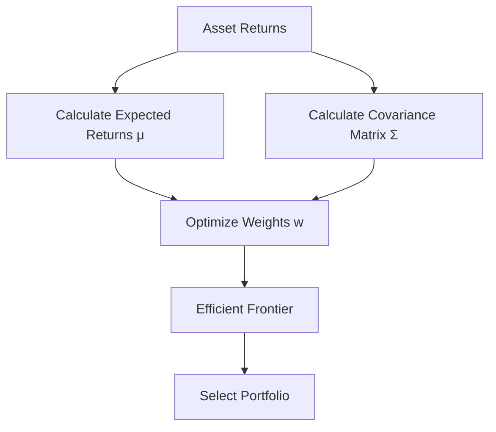

# Markowitz (1952) - Portfolio Selection
[__Citation: Markowitz, H. (1952). Portfolio Selection. The Journal of Finance, 7(1), 77–91.__](../paper/Markowitz_Portfolio_Selection_1952.pdf)

## Summary:
This seminal paper introduced Modern Portfolio Theory (MPT), formalizing the concept of diversification to minimize risk for a given expected return. Markowitz proposed optimizing portfolios by balancing expected returns and variance (risk), laying the foundation for mean-variance optimization. It’s a cornerstone for portfolio construction at hedge funds, though modern extensions account for non-normal distributions and transaction costs.
Key Takeaways:
- Portfolio optimization involves selecting weights $$w$$ to minimize variance $$\sigma_p^2 = \sqrt{w^T \Sigma w}$$ for a target return $$\mu_p = w^T \mu$$.
- The efficient frontier represents portfolios with the highest return for a given risk level.
- Hedge funds use this framework but adjust for leverage, constraints, and alternative risk measures (e.g., CVaR).

## MathJax Example:
The optimization problem is:

$$
\min_w \frac{1}{2} w^T \Sigma w \quad \text{s.t.} \quad w^T \mu = \mu_p, \quad w^T \mathbf{1} = 1
$$

where,
- $\Sigma$ is the covariance matrix,
- $\mu$ is the vector of expected returns, and
- $w$ are asset weights.

## Mermaid Diagram:

## Hedge Fund Relevance:
Used for baseline portfolio construction, but researchers at Citadel or Balyasny extend it with robust optimization or machine learning to handle estimation errors in $\mu$ and $\Sigma$.