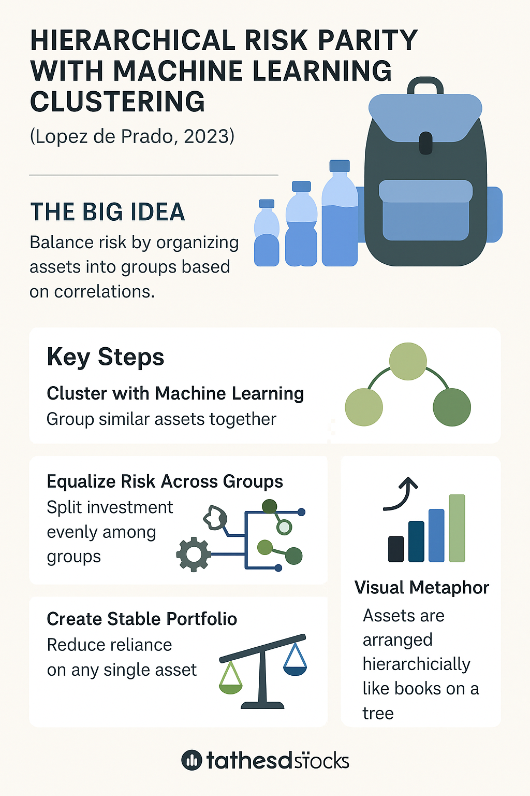

# LAYMAN EXPLANATION - of the paper - __Lopez de Prado (2023) - Hierarchical Risk Parity with Machine Learning Clustering__
Here’s the **layman’s explanation** of the **Lopez de Prado’s (2023)** paper — *Hierarchical Risk Parity with Machine Learning Clustering* — using **layman terms**, **real-life examples**, and **visual metaphors** to make it easy for a non-technical audience to grasp.

---

## 🧠 What’s the Big Idea?

Imagine you’re trying to carry a backpack full of different-sized water bottles (representing different stocks or assets). Some bottles are full and heavy (risky), some are half-full (moderately risky), and some are almost empty (low risk). If you just throw them all into your backpack without thinking, the bag might be unbalanced and tip over (your portfolio fails when markets become volatile).

**Lopez de Prado’s HRP method** says:

> “Let’s organize these bottles *smartly* by first grouping them by size and type, and then packing them in a way that keeps your backpack *stable and evenly weighted*.”

---

## 🔍 In Simpler Words:

Most traditional methods (like Markowitz's) try to optimize a portfolio based on mathematical expectations of risk and return. But in the real world, we often estimate these numbers poorly.

**Hierarchical Risk Parity (HRP)** takes a different route:

* It looks at how investments move *together* (their correlations).
* It uses **machine learning clustering** to group similar assets.
* Then it splits your investment evenly *across those groups*, not just individual stocks.
* This helps you **avoid putting all your eggs in the same basket**, even if they look different.

---

## 🧰 Real-Life Example:

Let’s say you’re packing for a week-long hiking trip:

* You bring **water**, **food**, **clothes**, and **tools**.
* If you just pack based on weight (risk), you might accidentally fill the bag with only water (a high-risk sector).
* Instead, HRP says: group your items (assets) into **categories that go together** — water with juice, clothes with sleeping bag — and **then** divide the weight equally among groups.

This gives you a **balanced, practical, and resilient packing strategy** — just like building a good investment portfolio.

---

## 🖼️ Visual Metaphor:

### Metaphor: **A Tree Organizing Books**

Imagine your portfolio as a library shelf:

* First, you **group books** by genre (action, history, romance) = *clustering assets*.
* Then, you arrange books on the shelf so they’re evenly spaced and **don’t tilt the shelf** = *risk parity*.
* The tree diagram (hierarchical structure) ensures **balance and diversity**, preventing one genre from dominating the shelf.

---

## 💼 Why Hedge Funds Love This

Big firms like **Balyasny** and **Point72** use HRP because:

* It’s **less sensitive to errors** in data estimation.
* It **adapts better** in uncertain and volatile markets.
* It allows **systematic diversification** based on real behavior (not just historical guesses).

---

## 🔢 Gentle Math Peek (Not Mandatory)

> **Risk Contribution of an asset**:
>

$$
RC\_i = w\_i \frac{(\Sigma w)\_i}{\sqrt{w^T \Sigma w}}
$$

This formula says:

- *“How much risk is this asset contributing to the total?*
- **HRP** tries to **balance** these contributions, so no single asset overwhelms the portfolio.

---

## 🧵 **As an Infographic**

