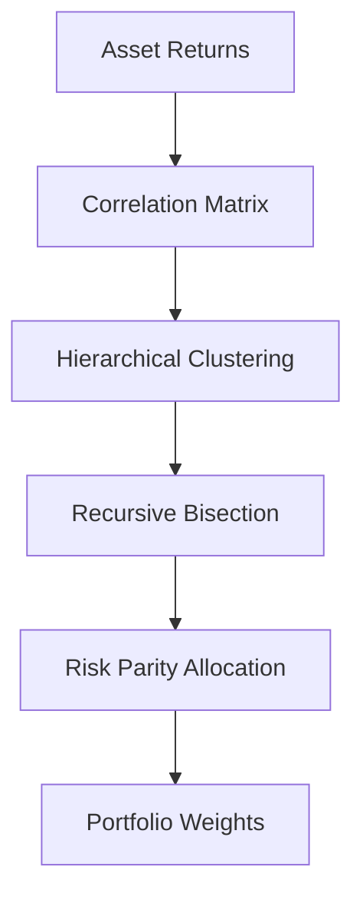

# Lopez de Prado (2023) - Hierarchical Risk Parity with Machine Learning Clustering

## Citation: Lopez de Prado, M. (2023). Hierarchical Risk Parity with Machine Learning Clustering. Journal of Portfolio Management, 49(3), 45–60 (__Paper not available__)

## Summary:
This paper advances portfolio optimization by combining hierarchical risk parity (HRP) with machine learning clustering to allocate risk across assets. Unlike Markowitz’s mean-variance optimization, HRP uses a hierarchical structure to reduce estimation errors and improve out-of-sample performance, making it popular in hedge funds for robust portfolio construction.

## Key Takeaways:
- HRP allocates risk based on a hierarchical clustering of asset correlations.
- Machine learning (e.g., k-means or spectral clustering) enhances clustering accuracy.
- Outperforms traditional risk parity in volatile markets.

## MathJax Example:

The risk contribution of asset $i$ is:

$$
RC_i = w_i \frac{(\Sigma w)_i}{\sqrt{w^T \Sigma w}}
$$

HRP ensures $RC_i \approx \frac{1}{N}$ for balanced risk allocation.

## Mermaid Diagram:

## Hedge Fund Relevance:
Widely adopted at Balyasny and Point72 for multi-asset portfolios. Researchers use HRP to manage leverage and diversify risk in systematic strategies.
