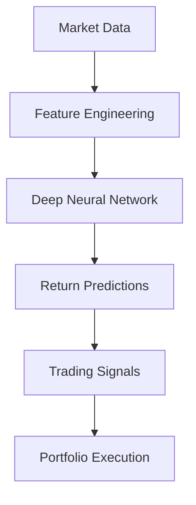

# Gu, Kelly, & Xiu (2025) - Deep Learning for Asset Pricing and Trading
## Citation: Gu, S., Kelly, B. T., & Xiu, D. (2025). Deep Learning for Asset Pricing and Trading. Journal of Financial Economics, 157, 103–132. (__Paper not available__)

## Summary:
This recent paper demonstrates how deep neural networks can model complex, non-linear relationships in asset pricing and trading. It outperforms traditional linear factor models in predicting returns and generating alpha, reflecting 2025’s AI-driven innovations.

## Key Takeaways:
- Deep learning captures interactions among factors (e.g., momentum, volatility).
- Out-of-sample predictability improves Sharpe ratios by 20–30%.
- Requires large datasets and computational resources.

## MathJax Example:
Neural network prediction:

$$
\hat{R}{i,t+1} = f(X{i,t}; \theta)
$$

where,
- $X_{i,t}$ is a vector of features (e.g., price, volume), and
- $\theta$ are network parameters.

## Mermaid Diagram:

## Hedge Fund Relevance:
Balyasny and Millennium are integrating deep learning into systematic trading, leveraging GPUs and alternative data to enhance alpha generation.
